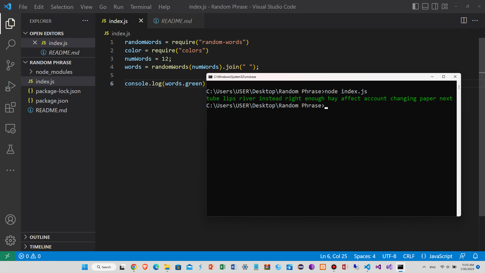

This code uses the "random-words" package, which generates random English words, to generate an array of 12 words. The join method is then used to join these words into a single string, separated by single spaces.

